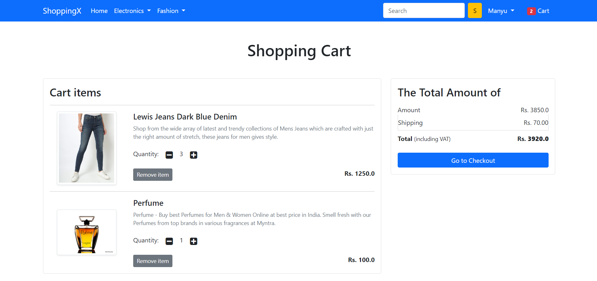
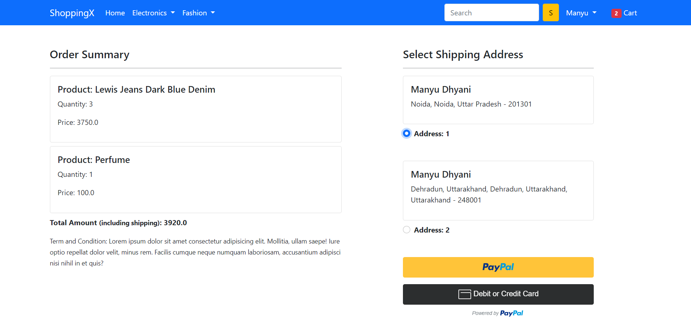
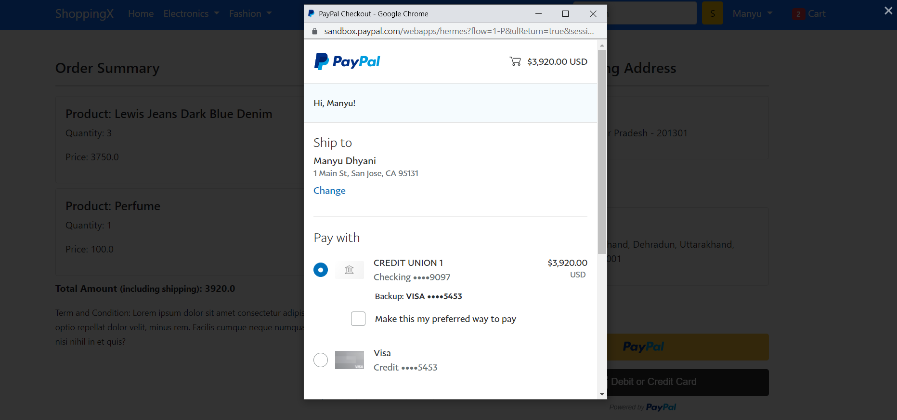
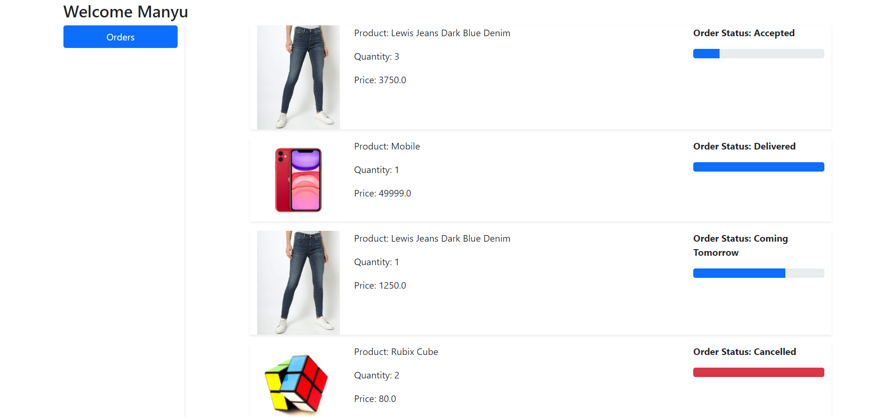
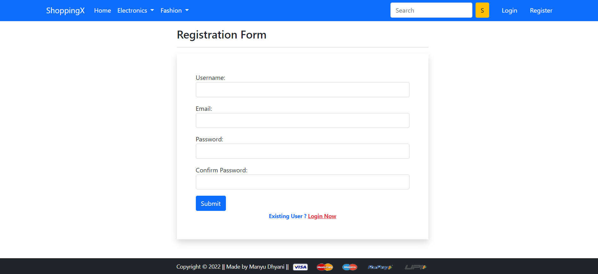
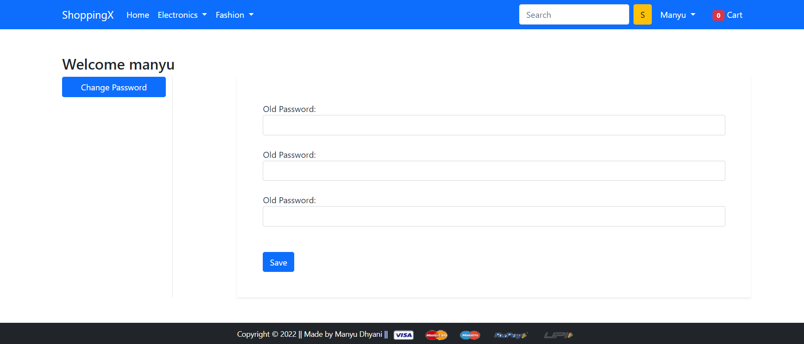
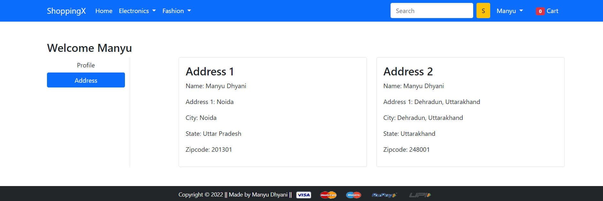

# Ecom_website

This is a Ecom Website made on Django Framework (Python) with HTML CSS and JS in FrontEnd. It have all functionalities of a modern ecom store which is cart and checkout pages with payment gateway (paypal) integration. Also provide users with order history and order status. User can also add any number of address and update other profile information including password.
## Product Detail Page

## Cart

## Checkout

## Paypal Integration

## Order History for the User

## Login Register

## Change Password Functionality

## User Address Profile

## Home Page and Mobile Responsive Template

